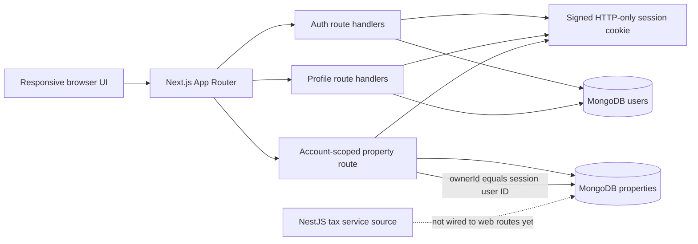

<div align="center">

# Mogul

### A clearer view of private real estate.

An account-based workspace for residential property records, portfolio metrics, and property-level tax metadata.

[](https://github.com/Skeeb32/residential-dashboard/stargazers)
[](https://github.com/Skeeb32/residential-dashboard/fork)
[](https://github.com/Skeeb32/residential-dashboard/issues)
[](https://github.com/Skeeb32/residential-dashboard/commits)

<br />

[Explore the architecture](#architecture) · [Run locally](#quick-start) · [Contribute](#contributing)

</div>

---

> **Project status:** early-stage working prototype. The Next.js application builds and includes Mongo-backed account routes. A MongoDB instance is required for real registration and sign-in. The NestJS tax service is present as source code, but is not yet connected to the web application's routes.

## The idea

Property information, account identity, and tax details belong in one place, with personal records scoped to the person signed in. Mogul pairs a focused portfolio dashboard with a small server-side account layer and an existing Mongoose property model.

The current interface is organized around four daily-use areas: **Overview**, **Portfolio**, **Tax center**, and **Account**. It is designed for a responsive workspace, not a marketing landing page.

## What is here

| Area                   | Current behavior                                                                                                                                            |
| ---------------------- | ----------------------------------------------------------------------------------------------------------------------------------------------------------- |
| Account access         | Register and sign in with a username and password; duplicate usernames or emails return an error.                                                           |
| Session                | Passwords are hashed with `bcryptjs`; a signed JWT is stored in an HTTP-only, same-site cookie.                                                             |
| Profile                | View and update display name and email. Username is immutable in the current UI.                                                                            |
| Personal dashboard     | Summarizes portfolio value, average target yield, annual depreciation metadata, and investor count for the signed-in account.                               |
| Portfolio              | Lists properties whose `ownerId` matches the signed-in user's MongoDB ObjectId.                                                                             |
| Tax center             | Displays property-level depreciation schedule, annual depreciation, and K-1 count when those fields exist.                                                  |
| Property model         | Retains the existing property fields and tax metadata; `ownerId` is an optional additive reference.                                                         |
| Tax calculation source | NestJS service calculates `purchasePrice / 27.5`, stores the result in `taxMetadata`, and logs the update. It is not currently exposed through a web route. |

## Architecture



### Technology

<div>


</div>

- **Web:** Next.js App Router, React, TypeScript, and Lucide icons.
- **Data:** MongoDB through Mongoose. The web app defines its user model and account routes; the property schema is also represented in `apps/api`.
- **Authentication:** `bcryptjs` password hashing and `jose` signed sessions. Session cookies are HTTP-only, `SameSite=Strict`, and `Secure` in production.
- **API source:** `apps/api` currently contains NestJS/Mongoose property and tax-engine source files, but no API package manifest or bootstrap application.

## Quick start

### Requirements

- Node.js and npm. The project was built locally with Node.js 22 and npm 10.
- A MongoDB instance reachable by the web app.
- OpenSSL (recommended for generating a session secret).

### 1. Clone and install

```bash
git clone https://github.com/Skeeb32/residential-dashboard.git
cd residential-dashboard/apps/web
npm ci
```

### 2. Configure the web app

Create `apps/web/.env.local` and set the Mongo connection string and a random secret. `.env.local` is ignored by Git.

Generate a secret with:

```bash
openssl rand -hex 32
```

Then put the connection string and generated value in `.env.local`:

```dotenv
MONGO_URI=mongodb://127.0.0.1:27017/mogul_db
SESSION_SECRET=replace-with-the-generated-64-character-value
```

`MONGODB_URI` is also accepted and takes precedence over `MONGO_URI`. The application defaults to `mongodb://127.0.0.1:27017/mogul_db` if neither is set. In production, `SESSION_SECRET` is required and must be at least 32 characters; do not use the development fallback or commit secrets.

### 3. Start the app

Make sure MongoDB is running, then from `apps/web`:

```bash
npm run dev
```

Open [http://localhost:3000](http://localhost:3000), create an account, and sign in. The production build is:

```bash
npm run build
npm start
```

## Using your workspace

1. Register with a display name, email, username, and password of at least 10 characters.
2. Sign in with your username and password. Your session lasts seven days unless you sign out.
3. Use Overview for account-level summaries, Portfolio for assigned property records, and Tax center for the tax metadata stored on those records.
4. Edit your display name or email in Account. Sign out from the top bar or account panel.

### Associate an existing property

Property records created before account ownership was added are preserved, but they have no `ownerId` and therefore do not appear in a personal portfolio. Mogul does not automatically assign legacy records to the first account. After confirming the correct owner, you can associate an individual record in `mongosh`:

```javascript
const user = db.users.findOne({ username: 'your-username' });

db.properties.updateOne(
  { _id: ObjectId('your-property-object-id') },
  { $set: { ownerId: user._id } },
);
```

Run this against the same `mogul_db` database used by the web app, and verify the selected property and user before updating production data.

## Data and tax notes

The property schema retains `title`, `address`, `status`, `purchasePrice`, `targetYieldPercentage`, `totalInvestorsCount`, and `taxMetadata`. The only ownership change is an optional indexed `ownerId` reference to a user.

The current tax service uses a 27.5-year straight-line estimate:

```text
annualDepreciationUSD = round(purchasePrice / 27.5, 2)
```

This is a code-level estimate, not tax advice or a complete tax calculation. The service does not currently account for land allocation, placed-in-service dates, or other tax-specific adjustments. The Tax center reads stored metadata; it does not trigger the NestJS service.

## Repository map

```text
apps/
├── api/src/modules/
│   ├── properties/schemas/property.schema.ts
│   └── tax-engine/tax-engine.service.ts
└── web/
    ├── src/app/
    │   ├── api/                 # Auth, profile, and property route handlers
    │   ├── layout.tsx
    │   └── page.tsx
    ├── src/components/          # Responsive dashboard and account experience
    ├── src/lib/                 # Mongo connection, user model, session helpers
    └── package.json
```

## Project health

- GitHub stars, forks, open issues, and last commit above are live repository badges, not hand-entered counts.
- `npm run build` compiles the web application and checks TypeScript.
- No automated test script or CI workflow is configured, no GitHub release is published, and the repository has no license file. No coverage or build-status badge is shown for that reason.
- `docker-compose.yml` describes MongoDB, API, and web services, but currently references `apps/api/Dockerfile` and `apps/web/Dockerfile`, which are not present. Use the local web setup above; Compose is not yet a working deployment path.

## Roadmap

- Add a property create/edit workflow with explicit ownership assignment.
- Provide a deliberate migration utility for assigning existing property records to users.
- Connect the NestJS tax service to an authenticated application route and add calculation tests.
- Add automated auth, authorization, and data-isolation tests plus continuous integration.
- Complete API/web container definitions and make Compose a verified development or deployment path.
- Add password recovery, password change, and production-grade authentication rate limiting.

## Contributing

Ideas, bug reports, and focused pull requests are welcome.

1. Open an [issue](https://github.com/Skeeb32/residential-dashboard/issues) for a substantial change so the scope can be discussed.
2. Fork the repository and create a focused branch.
3. Keep schema changes additive where possible, and include a migration or compatibility note when changing persisted data.
4. From `apps/web`, run `npm run build` before opening a pull request. Automated test coverage is not configured yet.
5. Describe what changed, how you verified it, and any database or environment setup required.

Please do not include real user records, credentials, connection strings, or production secrets in issues, screenshots, commits, or pull requests.

## For engineers and recruiters

This repository demonstrates a practical slice of a data-backed application: typed React UI, responsive navigation, server-side route handlers, Mongo/Mongoose persistence, password hashing, signed cookie sessions, account-scoped queries, schema evolution, and a property-level tax calculation service. It is an early-stage prototype rather than a finished financial product; the repository status and integration boundaries above are intentional parts of the technical picture.

## Build with us

If the direction is useful, [star the repository](https://github.com/Skeeb32/residential-dashboard) to follow its progress, open an issue with a concrete idea, or send a focused pull request. Every contribution should help make property information easier to understand and safer to manage.
